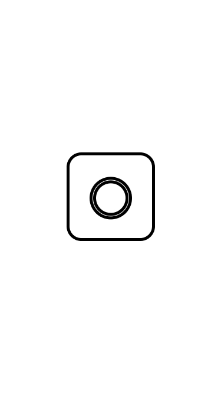
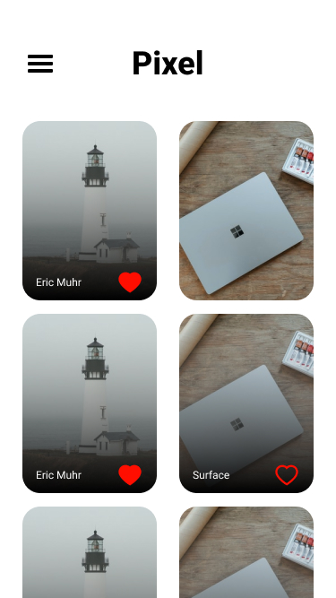

# Pixel

    
    

## Descrição

Aplicativo para visualizar e salvar fotos obtidas pela API Lorem Picsum.

## Dependências

    Algumas dependências utilizada neste projeto são:

<ul>
<li>Expo</li>
<li>Styled Componentes</li>
<li>Lottie</li>
</ul>

## Obter Projeto

Clone o repositório:

    git clone https://github.com/Gusttavo-Larios/Pixel.git

Instale as dependências:

    yarn install

Execute o projeto:

    expo start

## Licença.

Este projeto está sobre a licença MIT.

## Mostre seu apoio

De uma ⭐se este repositório te ajudou.